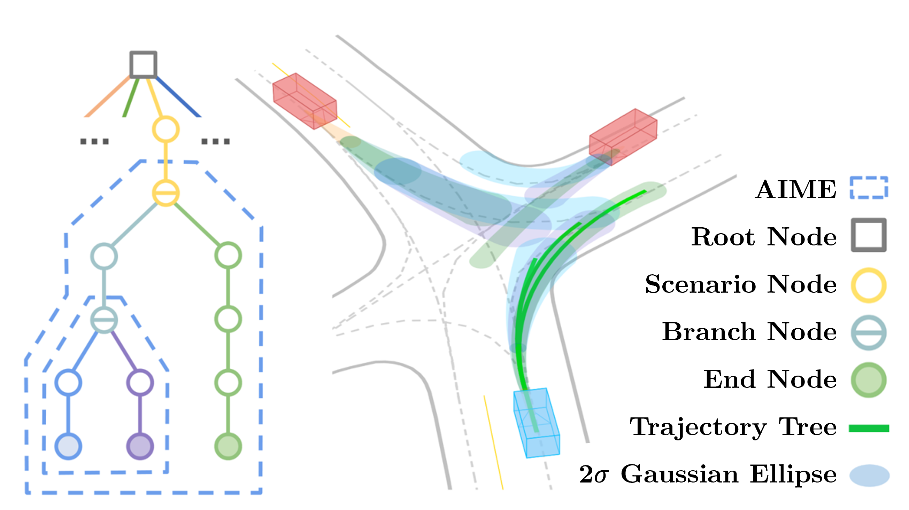
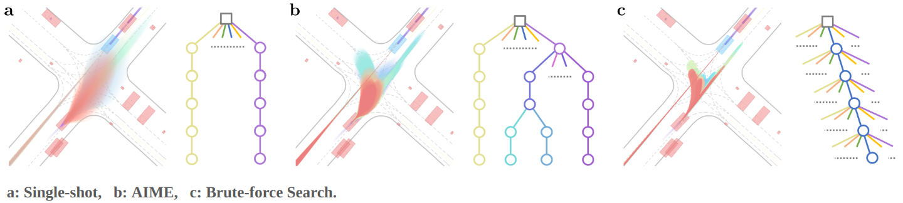

    <h2>MIND: <ins>M</ins>ulti-modal <ins>I</ins>ntegrated Predictio<ins>N</ins> and <ins>D</ins>ecision-making with Adaptive Interaction Modality Explorations</h2>
     
        <a href="https://uav.hkust.edu.hk/current-members/" target="_blank">Tong Li</a>*†,
        <a href="https://masterizumi.github.io/" target="_blank">Lu Zhang</a>*,
        <a href="https://github.com/sikang" target="_blank">Sikang Liu</a>,
        <a href="https://uav.hkust.edu.hk/group/" target="_blank">Shaojie Shen</a>
    

        <h45>
            HKUST Aerial Robotics Group &nbsp;&nbsp;
             
        </h5>
        *Equal Contributions
        †Corresponding Author
    

    

  

## Quantitative Comparison of AIME

  

## Qualitative Results On Argoverse 2

  
  
  
  

## Todo List
- [x] First release 08/27/2024
- [ ] Release closed-loop simulation for Argoverse 2

## Acknowledgment
We would like to express sincere thanks to the authors of the following packages and tools:
- [SIMPL](https://github.com/HKUST-Aerial-Robotics/SIMPL)
- [ILQR](https://github.com/anassinator/ilqr)

